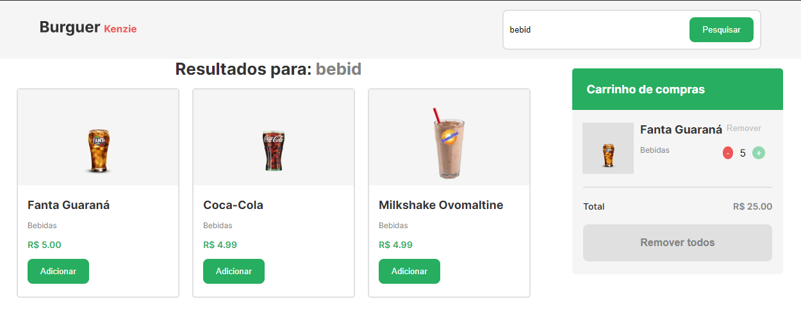

## Kenzie Burguer / isgabriel

Kenzie Burguer é uma loja no estilo fast-food que vende sanduíches e bebidas. Os itens disponíveis são consumidos de uma API. No site é possível adicionar itens ao carrinho e visualizá-los. Além disso, é possível buscar por itens específicos, tanto por categoria quanto pelo próprio nome do item, utilizando a barra de pesquisa. É possível adicionar ou remover mais de um item do mesmo tipo ao carrinho por meio de botões de adicionar "+" e remover "-" dentro do carrinho de compras, além de conseguir remover todos os itens do carrinho de uma só vez ao clicar no botão "Remover todos".

## Tecnologias

Aqui estão as tecnologias usadas nesse projeto:

-   React

## Bibliotecas

Aqui estão as bibliotecas usadas nesse projeto:

-   axios
-   react-toastify
-   styled-components

## Serviço usado

-   Github
-   Vite
-   Vercel

## Como usar

 <h3>1 - Ao acessar a página, você verá a página inicial</h3>
 

 <h3>2 - É possível adicionar itens ao carrinho de compras</h3>
 

 <h3>3 - Efeito ao passar o cursor por cima dos cards e do botão de adicionar :)</h3>
 

 <h3>4 - Efeito do botão "Remover todos"</h3>
 

 <h3>5 - Efeito do Input quando está selecionado</h3>
 

 <h3>6 - É posível realizar busca por categoria ou por nome do item <3</h3>
 

## Funcionalidades

As principais funcionalidades da aplicação são:

-   Consumo de API para listagem dos itens disponíveis;
-   Adicionar/Remover itens ao/do carrinho;
-   Buscar itens por meio da barra de pesquisa;
-   Animações para embelezamento do site.

## Links

-   Deploy: https://react-entrega-template-hamburgueria-da-kenzie-isgabriel.vercel.app
-   Repository: https://github.com/isgabriel/Kenzie-Burguer

## Autores

-   <strong>Gabriel Fragoso Montenegro</strong>
     

Por favor, siga o github e junte-se a nós! Obrigado pela visita! <3
